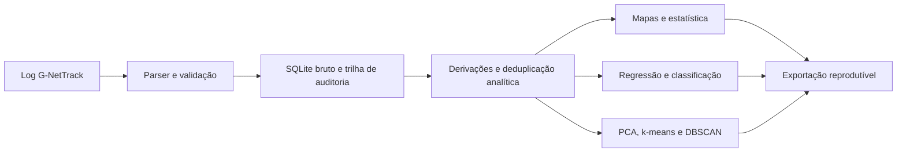
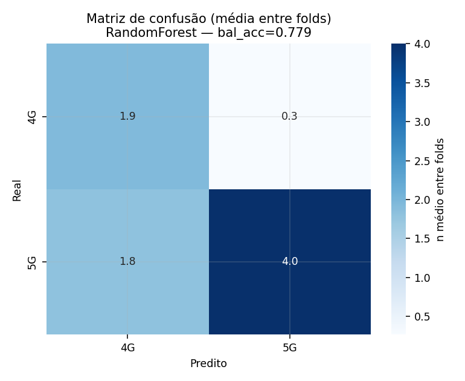
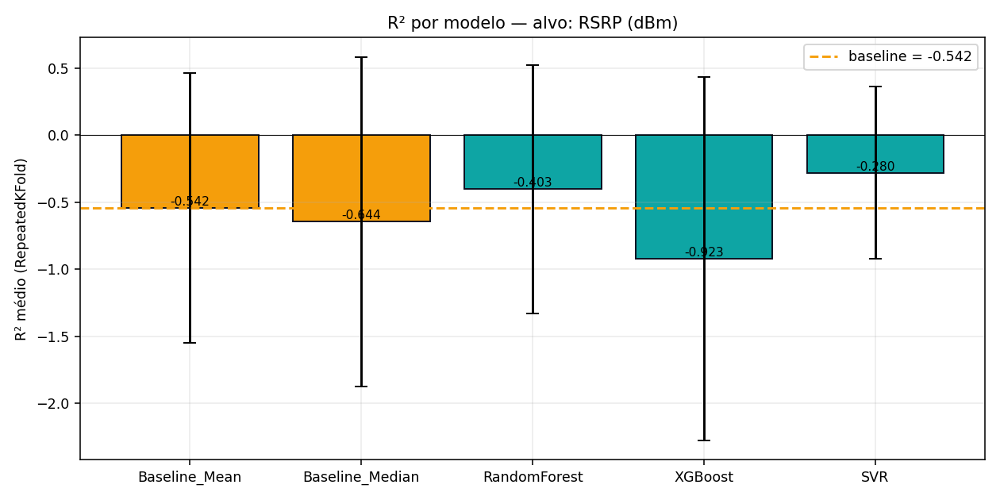

# Plataforma Científica RF — FEG-UNESP


Aplicação local e reprodutível para ingestão, auditoria, exploração espacial e
modelagem de medições comerciais 5G NSA. O projeto foi desenvolvido como
Iniciação Científica em Engenharia de Produção na FEG-UNESP.

> **Escopo:** caracterização empírica da cobertura e do desempenho observado
> nas rotas medidas. O aplicativo não isola o portador NR, não mede CIR/PDP,
> não calcula *path loss* absoluto e não recomenda implantação de infraestrutura.

## O problema que o projeto resolve

Logs de *walk test* misturam métricas de rádio, GPS, QoS e contexto ambiental,
frequentemente com campos ausentes e cadências diferentes. A plataforma reúne
essas fontes em uma cadeia auditável:



Principais recursos:

- importação de logs TXT, TSV, CSV e LOG, com detecção de formato;
- rastreabilidade por SHA-256, campanha e execução;
- preservação explícita de ausências — o pipeline não substitui desconhecidos
  por zero;
- separação entre linhas brutas e estados analíticos deduplicados;
- mapas de sinal e QoS, resumos por setor, ambiente e campanha;
- regressão linear, Random Forest, XGBoost e SVR;
- classificação com Random Forest, XGBoost e SVC;
- PCA, k-means e DBSCAN para caracterização exploratória dentro das rotas;
- validação agrupada por campanha, setor, data ou arquivo;
- exportações científica e completa.

## Começo rápido

Recomendado: Python 3.11.

O pipeline é testado com pandas 3 em Python 3.11 ou superior. Para instalações
legadas em Python 3.10, o arquivo de dependências mantém pandas 2.3.

### Windows

1. Execute `1_INSTALAR.bat`.
2. Execute `2_INICIAR_DASHBOARD.bat`.
3. Acesse <http://127.0.0.1:8000>.

### Terminal

```bash
python -m venv .venv
# Windows: .venv\Scripts\activate
# Linux/macOS: source .venv/bin/activate
python -m pip install --upgrade pip
python -m pip install -r requirements.txt
copy .env.example .env  # Windows; em Linux/macOS use: cp .env.example .env
python -m uvicorn app.main:app --host 127.0.0.1 --port 8000
```

A documentação interativa da API fica em <http://127.0.0.1:8000/docs>.

Para preencher clima histórico após importar campanhas reais:

```bash
python scripts/backfill_weather_archive.py --dry-run
python scripts/backfill_weather_archive.py
# opcional: --campaign nome-da-campanha
```

O primeiro comando consulta e valida sem persistir; o segundo grava os valores
horários auditáveis e as medianas de campanha usadas nas colunas efetivas.

## Demonstração sem dados reais

Gere um log inteiramente sintético:

```bash
python scripts/generate_demo_log.py
```

No aplicativo, importe `data/demo/demo_gnettrack_synthetic.tsv`, informe uma
campanha como `demo-sintetica` e desative o enriquecimento externo. O arquivo
serve apenas para demonstrar o fluxo; **não é evidência científica**.

Dados reais, bancos SQLite, coordenadas, logs, calibrações e exportações são
ignorados pelo Git. Consulte [data/README.md](data/README.md).

## Resultados de validação

Figuras agregadas da modelagem (métricas de qualidade, **sem dados brutos nem
localizações**). A validação é sempre **agrupada por campanha**, para não
superestimar o desempenho.



*Classificação 4G vs 5G (Random Forest): acurácia balanceada ≈ 0,78 sob
validação agrupada — o modelo distingue a tecnologia com desempenho consistente.*



*Regressão do RSRP absoluto: sob validação agrupada por campanha, nenhum modelo
supera de forma robusta o baseline (R² próximo de zero ou negativo). É um
resultado **honesto e esperado** — prever o nível absoluto de sinal exige mais
contexto do que as rotas medidas oferecem, e reportá-lo assim evita conclusões
infladas por vazamento entre amostras. O valor do projeto está na cadeia
auditável e na metodologia, não em forçar um número.*

## Guardrails científicos

- As métricas de rádio representam a portadora primária reportada pelo aparelho
  durante uma sessão 5G NSA; a associação LTE↔NR não é assumida como definitiva.
- A matriz analítica consolida pseudorreplicações exatas em memória, preservando
  o banco bruto e registrando a chave usada.
- Clima analítico segue `manual em campo > Open-Meteo Archive > ausente`.
  Valores legados do endpoint meteorológico `current` não entram nas colunas
  efetivas históricas.
- Tipo de superfície e categoria ambiental são variáveis nominais. A
  codificação dos modelos é ajustada somente no treino de cada divisão.
- Validação agrupada é a estimativa principal. A divisão aleatória por linha é
  mantida apenas para demonstrar o efeito otimista da autocorrelação das rotas.
- A inclinação log-distância, a referência espacial estimada e a diferença
  indoor–outdoor são resultados descritivos, não parâmetros físicos absolutos.
- A referência espacial é experimental e vem desativada no perfil público;
  habilitá-la exige `FEG_ENABLE_SITE_REFERENCE=true` e justificativa própria.
- PCA e agrupamentos descrevem similaridades internas às rotas e não
  generalizam espacialmente para áreas não medidas.

Detalhes completos estão em [Metodologia](docs/METHODOLOGY.md) e no
[Dicionário de dados](docs/DATA_DICTIONARY.md).

## Testes e qualidade

```bash
python -m pip install -r requirements-dev.txt
python -m ruff check app tests scripts
python -m pytest -m "not slow"
python -m pytest -m slow
```

O CI executa lint obrigatório, testes rápidos e testes científicos de ML em
Python 3.11. Nenhum teste depende do banco real do projeto.

## Estrutura

```text
app/                    API, interface e módulos analíticos
app/sectors/            classificação espacial e calibração
tests/                  testes unitários e de integração
scripts/                utilitários públicos e reprodutíveis
docs/                   metodologia e documentação
data/                   artefatos locais ignorados pelo Git
.github/workflows/      integração contínua
```

## Limitações operacionais

O servidor foi concebido para execução local em `127.0.0.1`. Uploads,
exportações e rotas de recalibração não possuem autenticação; não exponha o
processo diretamente à internet. Consulte [SECURITY.md](SECURITY.md).

## Autoria e contexto acadêmico

- **Aluno:** João Guilherme de Castro Monteiro — Engenharia de Produção,
  FEG-UNESP.
- **Orientador:** Prof. Dr. Carlos Augusto Marcondes dos Santos.

Para citar o software, use os metadados de [CITATION.cff](CITATION.cff).

## English overview

This repository contains a local, audit-oriented platform for ingesting,
mapping and modelling commercial 5G NSA field measurements. Its scope is
empirical characterisation within measured routes; it does not perform
physical channel sounding, isolate the NR carrier or recommend network
infrastructure deployment.

## Licença

Código distribuído sob a [Licença MIT](LICENSE). Dados de campo não fazem parte
dessa licença nem deste repositório.
