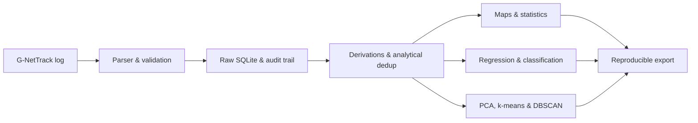
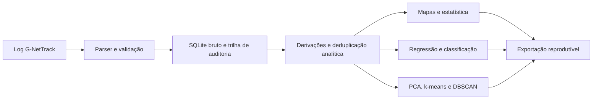

# RF Scientific Platform — FEG-UNESP


**English** · [Português](#-português)

Local, reproducible application for ingesting, auditing, spatially exploring and modelling
commercial 5G NSA measurements. Developed as a Scientific Initiation (undergraduate research)
in Production Engineering at FEG-UNESP.

> **Scope:** empirical characterization of coverage and observed performance along the
> measured routes. The app does not isolate the NR carrier, does not measure CIR/PDP, does
> not compute absolute path loss, and does not recommend infrastructure deployment.

## The problem it solves

Walk-test logs mix radio, GPS, QoS and environmental-context metrics, often with missing
fields and different cadences. The platform gathers these sources into an auditable chain:



Key features: TXT/TSV/CSV/LOG import with format detection; traceability by SHA-256, campaign
and run; **explicit preservation of missing values** (unknowns are never replaced by zero);
separation of raw rows from deduplicated analytical states; signal and QoS maps, summaries by
sector, environment and campaign; linear regression, Random Forest, XGBoost and SVR;
classification with Random Forest, XGBoost and SVC; PCA, k-means and DBSCAN for exploratory
characterization within routes; **campaign-, sector-, date- or file-grouped validation**; and
scientific + full exports.

## Quick start

Recommended: Python 3.11 (the pipeline is tested with pandas 3). **Windows:** run
`1_INSTALAR.bat`, then `2_INICIAR_DASHBOARD.bat`, and open <http://127.0.0.1:8000>.

**Terminal:**

```bash
python -m venv .venv
# Windows: .venv\Scripts\activate  |  Linux/macOS: source .venv/bin/activate
python -m pip install --upgrade pip
python -m pip install -r requirements.txt
cp .env.example .env            # Windows: copy .env.example .env
python -m uvicorn app.main:app --host 127.0.0.1 --port 8000
```

Interactive API docs at <http://127.0.0.1:8000/docs>.

## Demo without real data

```bash
python scripts/generate_demo_log.py
```

Import `data/demo/demo_gnettrack_synthetic.tsv`, name a campaign like `demo-sintetica` and
disable external enrichment. It only demonstrates the flow; **it is not scientific evidence**.
Real data, SQLite databases, coordinates, logs, calibrations and exports are Git-ignored.

## Validation results

Aggregate modelling figures (quality metrics, **no raw data and no locations**). Validation is
always **campaign-grouped**, to avoid overestimating performance.


*4G vs 5G classification (Random Forest): balanced accuracy ≈ 0.78 under grouped validation —
the model distinguishes the technology with consistent performance.*


*Absolute-RSRP regression: under campaign-grouped validation, no model robustly beats the
baseline (R² near zero or negative). This is an **honest and expected** result — predicting the
absolute signal level needs more context than the measured routes offer, and reporting it this
way avoids conclusions inflated by leakage between samples. The value is in the auditable chain
and the methodology, not in forcing a number.*

## Scientific guardrails

- Radio metrics represent the primary carrier reported by the device during a 5G NSA session;
  the LTE↔NR association is not assumed definitive.
- The analytical matrix consolidates exact pseudo-replications in memory, preserving the raw
  database and recording the key used.
- Analytical weather follows `manual in field > Open-Meteo Archive > missing`. Legacy values
  from the `current` endpoint do not enter the effective historical columns.
- Surface type and environment category are nominal variables; model encoding is fit only on
  each split's training fold.
- Grouped validation is the primary estimate. Random per-row splitting is kept only to
  demonstrate the optimistic effect of route autocorrelation.
- Log-distance slope, estimated spatial reference and the indoor–outdoor difference are
  descriptive results, not absolute physical parameters.
- The spatial reference is experimental and disabled in the public profile; enabling it
  requires `FEG_ENABLE_SITE_REFERENCE=true` and its own justification.
- PCA and clusters describe within-route similarities and do not generalize spatially to
  unmeasured areas.

Full details in [Methodology](docs/METHODOLOGY.md) and the [Data dictionary](docs/DATA_DICTIONARY.md).

## Tests & quality

```bash
python -m pip install -r requirements-dev.txt
python -m ruff check app tests scripts
python -m pytest -m "not slow"
python -m pytest -m slow
```

CI runs mandatory lint, fast tests and scientific ML tests on Python 3.11. No test depends on
the project's real database.

## Structure

```text
app/                  API, interface and analytical modules
app/sectors/          spatial classification and calibration
tests/                unit and integration tests
scripts/              public, reproducible utilities
docs/                 methodology and documentation
data/                 local, Git-ignored artifacts
.github/workflows/    continuous integration
```

## Operational limitations

The server is designed to run locally on `127.0.0.1`. Uploads, exports and recalibration routes
have no authentication; do not expose the process directly to the internet. See [SECURITY.md](SECURITY.md).

## Authorship & academic context

- **Student:** João Guilherme de Castro Monteiro — Production Engineering, FEG-UNESP.
- **Advisor:** Prof. Dr. Carlos Augusto Marcondes dos Santos.

To cite the software, use the metadata in [CITATION.cff](CITATION.cff). Code under the
[MIT License](LICENSE); field data is not part of this license or repository.

---

<a name="-português"></a>

# 🇧🇷 Português — Plataforma Científica RF (FEG-UNESP)

Aplicação local e reprodutível para ingestão, auditoria, exploração espacial e
modelagem de medições comerciais 5G NSA. O projeto foi desenvolvido como
Iniciação Científica em Engenharia de Produção na FEG-UNESP.

> **Escopo:** caracterização empírica da cobertura e do desempenho observado
> nas rotas medidas. O aplicativo não isola o portador NR, não mede CIR/PDP,
> não calcula *path loss* absoluto e não recomenda implantação de infraestrutura.

## O problema que o projeto resolve

Logs de *walk test* misturam métricas de rádio, GPS, QoS e contexto ambiental,
frequentemente com campos ausentes e cadências diferentes. A plataforma reúne
essas fontes em uma cadeia auditável:



Principais recursos: importação de logs TXT/TSV/CSV/LOG com detecção de formato;
rastreabilidade por SHA-256, campanha e execução; **preservação explícita de
ausências** (o pipeline não substitui desconhecidos por zero); separação entre
linhas brutas e estados analíticos deduplicados; mapas de sinal e QoS, resumos por
setor/ambiente/campanha; regressão linear, Random Forest, XGBoost e SVR;
classificação com Random Forest, XGBoost e SVC; PCA, k-means e DBSCAN;
**validação agrupada por campanha, setor, data ou arquivo**; e exportações
científica e completa.

## Começo rápido

Recomendado: Python 3.11. **Windows:** execute `1_INSTALAR.bat`, depois
`2_INICIAR_DASHBOARD.bat`, e acesse <http://127.0.0.1:8000>.

```bash
python -m venv .venv
# Windows: .venv\Scripts\activate  |  Linux/macOS: source .venv/bin/activate
python -m pip install --upgrade pip
python -m pip install -r requirements.txt
copy .env.example .env          # Linux/macOS: cp .env.example .env
python -m uvicorn app.main:app --host 127.0.0.1 --port 8000
```

Documentação interativa da API em <http://127.0.0.1:8000/docs>.

## Demonstração sem dados reais

```bash
python scripts/generate_demo_log.py
```

Importe `data/demo/demo_gnettrack_synthetic.tsv`, informe uma campanha como
`demo-sintetica` e desative o enriquecimento externo. Serve apenas para demonstrar
o fluxo; **não é evidência científica**. Dados reais, bancos SQLite, coordenadas,
logs, calibrações e exportações são ignorados pelo Git.

## Resultados de validação

As figuras agregadas (classificação 4G vs 5G e R² por modelo, **sem dados brutos
nem localizações**) estão na seção **Validation results** acima. A validação é
sempre **agrupada por campanha**. O R² próximo de zero/negativo na regressão do
RSRP absoluto é um resultado **honesto e esperado** — o valor do projeto está na
cadeia auditável e na metodologia, não em forçar um número.

## Guardrails científicos

- As métricas de rádio representam a portadora primária reportada pelo aparelho
  durante uma sessão 5G NSA; a associação LTE↔NR não é assumida como definitiva.
- A matriz analítica consolida pseudorreplicações exatas em memória, preservando
  o banco bruto e registrando a chave usada.
- Clima analítico segue `manual em campo > Open-Meteo Archive > ausente`.
- Tipo de superfície e categoria ambiental são variáveis nominais; a codificação
  é ajustada somente no treino de cada divisão.
- Validação agrupada é a estimativa principal; a divisão aleatória por linha
  demonstra apenas o efeito otimista da autocorrelação das rotas.
- Inclinação log-distância, referência espacial e diferença indoor–outdoor são
  resultados descritivos, não parâmetros físicos absolutos.
- A referência espacial é experimental e vem desativada no perfil público.
- PCA e agrupamentos descrevem similaridades internas às rotas e não generalizam
  para áreas não medidas.

Detalhes completos em [Metodologia](docs/METHODOLOGY.md) e no
[Dicionário de dados](docs/DATA_DICTIONARY.md).

## Testes e qualidade

```bash
python -m pip install -r requirements-dev.txt
python -m ruff check app tests scripts
python -m pytest -m "not slow"
python -m pytest -m slow
```

O CI executa lint obrigatório, testes rápidos e testes científicos de ML em
Python 3.11. Nenhum teste depende do banco real do projeto.

## Estrutura

```text
app/                    API, interface e módulos analíticos
app/sectors/            classificação espacial e calibração
tests/                  testes unitários e de integração
scripts/                utilitários públicos e reprodutíveis
docs/                   metodologia e documentação
data/                   artefatos locais ignorados pelo Git
.github/workflows/      integração contínua
```

## Limitações operacionais

O servidor foi concebido para execução local em `127.0.0.1`. Uploads, exportações
e rotas de recalibração não possuem autenticação; não exponha o processo
diretamente à internet. Consulte [SECURITY.md](SECURITY.md).

## Autoria e contexto acadêmico

- **Aluno:** João Guilherme de Castro Monteiro — Engenharia de Produção, FEG-UNESP.
- **Orientador:** Prof. Dr. Carlos Augusto Marcondes dos Santos.

Para citar o software, use os metadados de [CITATION.cff](CITATION.cff). Código sob a
[Licença MIT](LICENSE); dados de campo não fazem parte dessa licença nem deste repositório.
